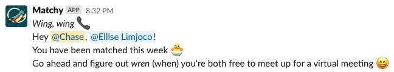

# Matchy
A Slack Bot that pairs people in a given channel to meet up for a one-on-one.

## Introduction
Coronavirus has taken away the social norms of creating friends in-person. Nowadays, it's difficult to meet new people, form bonds, and foster community. This is especially true for large organizations whose members can no longer meet face to face. With Matchy in your Slack workspace, freely *spread your wings* and start forming new connections while building a sense of community within your org!

## Features
On command, this Slack Bot:
* Introduces each user in a channel to a fellow, randomized, member on the team.
* Instigates one-on-one virtual meetings for its paired users.
* Keeps track of previously paired users to more evenly distribute the pairings.

## Dependencies
Slack : `pip install slackclient`

## Running Matchy  
To get Matchy running in your Slack Workspace, follow the steps below:
- [Create a new Slack App](https://api.slack.com/apps) install it in your Slack Workspace
  - Update the `Display Information` to add the Matchy name and logo
  - Add the necessary *Bot Token Scopes*
    - channels:read
    - chat:write
    - mpim:write
  - Install into your workspace and retrieve the *Bot User OAuth Access Token*!
- Create a file in your `matchy/` directory called `config.py` and add these two lines
  - `OAUTH_TOKEN = ...` with your *Bot User OAuth Access Token*
  - `IGNORE_LIST = []` with any user IDs that you would like to ignore when generating pairs.
  - `CHANNEL = ...` with the ID of your channel. You can find this by right clicking on the channel, "Copy Link", and taking the ID at the end of the URL
- Finally, run Matchy to pair people in the channel. You will need to run Matchy each time you want new pairings to go out:
  - `python matchy.py`

Previous partners will be stored to the file called `partners.json`.

## Contributors
- [@ChaseC99](https://github.com/ChaseC99)
- [@ell-ml](https://github.com/ell-ml)
